<div align="center">
    <h1>EdSr: A Novel End-to-End Approach for State-Space Sampling in Molecular Dynamics Simulation</h1>
     <p align="center"> 
        Hai-Ming Cao<sup>1</sup> · <a href="https://scholar.google.com/citations?hl=en&user=iOIRgyAAAAAJ">Bin Li</a><sup>1*</sup>
    </p>
    <p align="center"> 
        <b>School of Chemical Engineering and Technology, Sun Yat-Sen University, Zhuhai 519082, China</b>
    </p>
    <p align="center"> 
    <sup>*</sup> E-mail: libin76@mail.sysu.edu.cn
    </p>
    </p>  
    <a href="https://github.com/haiming-Cao/EdSr/blob/main/LICENSE">
    
    </a>
    <a href="https://arxiv.org/abs/2412.20978">
    
    </a>
    <a href="https://arxiv.org/abs/2412.20978">
    
    </a>
</a>

</div>


<!-- [ArXiv Link]() | [Supplementary]() -->

## Overview

> The molecular dynamics (MD) simulation technique has been widely used in complex systems, but the time scale is limited due to the small timestep.  Here, we propose a novel method, named Exploratory dynamics Sampling with recursion (EdSr),  which an be used in MD simulation with flexible timestep, inspired by Langevin dynamics,  Stochastic Differential Equation and Taylor expansion formula.  By setting up four groups of experiments including simple function, ideal physical model, all-atom simulation and coarse-grained simulation,  we demonstrate that EdSr can dynamically and flexibly adjust the simulation timestep according to requirements during simulation period, and can work with larger timestep than the widely used velocity-Verlet integrator. Although this method can not perform perfectly at flexible timestep with all simulation systems, we believe that it will be a promising approach in the future.

## Code File Repository
The **IdealPendulum**, **IdealSpring**, **solveEquation**, **twoBody**, **ubiquitin**, **Indole** directories are as follows :
```
├── Equation
│   ├── Equation.py
│   ├── Equation_thirdOrder.py
│   ├── first_experiment.ipynb
│   └── second_experiment.ipynb
├── IdealPendulum
│   ├── data.py
│   ├── first_experiment.ipynb
│   ├── idealPendulum.py
│   └── second_experiment.ipynb
├── IdealSpring
│   ├── first_experiment.ipynb
│   ├── idealSpring.py
│   └── second_experiment.ipynb
├── Indole
│   ├── lmps
│   │   ├── data_beta.lammps
│   │   ├── in_beta.lammps
│   │   └── nvt_1ns_indole.data
│   └── our
│       ├── compute.py
│       ├── core_c.pyx
│       ├── core.py
│       ├── dataAnalysis.ipynb
│       ├── data.py
│       ├── draw.ipynb
│       ├── EdSr.sh
│       ├── grid_loop.py
│       ├── paper_coord_rmsd.ipynb
│       ├── paper_ke_epair_emol_press.ipynb
│       ├── paper_rdf_vdist.ipynb
│       └── setup.py
├── twoBody
│   ├── data.py
│   ├── first_experiment.ipynb
│   ├── seond_experiment.ipynb
│   ├── show.ipynb
│   ├── trajectory.ipynb
│   └── twoBodies.py
├── ubiquitin
│   ├── lmps
│   │   ├── dynamics.lammps
│   │   ├── in.lammps
│   │   └── simulation.sh
│   ├── martini_gmx
│   │   └──  ...
│   └── our
│       ├── add_features.ipynb
│       ├── compute.py
│       ├── core.py
│       ├── EdSr.sh
│       ├── grid_loop.py
│       ├── paper_coord_rmsd_rg_10_20.ipynb
│       ├── paper_coord_rmsd_rg_30.ipynb
│       ├── paper_ke_epair_emol_press_10_20.ipynb
│       ├── paper_ke_epair_emol_press_30.ipynb
│       ├── paper_rdf_vdist_10_20.ipynb
│       ├── paper_rdf_vdist_30.ipynb
│       └── trans_format.py
└── ubiquitin_nowater
    ├── martini_gmx
    │   └──  ...
    └── our
        ├── add_features.ipynb
        ├── compute.py
        ├── core.py
        ├── EdSr.sh
        ├── grid_loop.py
        ├── paper_coord_rmsd_rg_20_30.ipynb
        ├── paper_ke_epair_emol_press_20_30.ipynb
        ├── paper_vdist_20_30.ipynb
        └── trans_format.py
```

## 🛠️ Requirements

!!! warning PYTHON version >= 3.11

Third-Party Package|Version|
|:-:|:-:|
|numpy|>=1.26.0|
|scipy|>=1.11.3|
|einops|>=0.6.1|
|tqdm|>=4.65.0|
|matplotlib|>=3.7.2|
|lammps|==2024.4.17|
|mpi4py|>=3.1.6|

## 📖 Method

The part of displacement of EdSr can be rewritten as the following form:

$$
X_{n-1} = X_N + \frac{1}{2n-1} \Big(X'_N\Delta t - \frac{1}{2n}\frac{\nabla_X U(X_n)}{M}(\Delta t)^{2}\Big), \quad n\ \rm{for}\ N\ to\ 1 
$$

where $X_0$, $X_N$, $X_N'$ denote $X(b)$, $X(a)$, $X'(a)$ respectively. According to the definition of derivative, the part of velocity of EdSr can be expressed as:

$$
X_{n-1} =  X_N + \frac{1}{2n-2} \Big(X'_N\Delta t - \frac{1}{2n-1}\frac{\nabla_X U(X_n)}{M}(\Delta t)^{2}\Big), \quad n\ \rm{for}\ N\ to\ 2
$$

$$
X'_0 =  X'_N - \frac{\nabla_X U(X_1)}{M}\Delta t,  \quad  n = 1
$$

where $X'_0$ denotes $X'(b)$. 

## 📈 Results

!!! Note In this section, we only show figures for each experiment. if you are interested in our work, you can get to know from our [paper](https://arxiv.org/abs/2412.20978) and [supplementary](https://arxiv.org/abs/2412.20978).

<!-- <div class="admonition note">
<p class="admonition-title">In this section, we only show figures for each experiment. if you are interested in our work, you can get to know from <a href="https://arxiv.org/abs/2412.20978">our paper</a> and <a href="https://arxiv.org/abs/2412.20978">supplementary</a></p>
</div> -->

### Equation

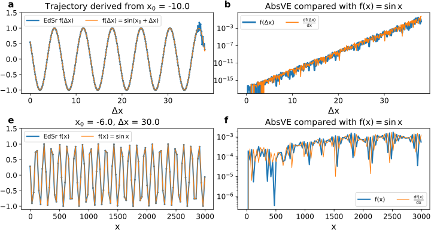 | 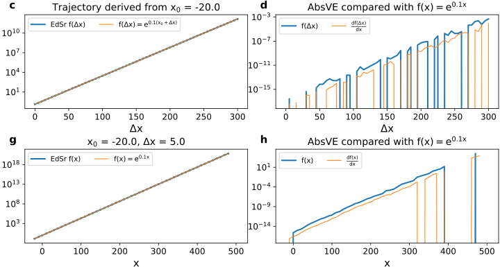
|-|-|

### ideal spring

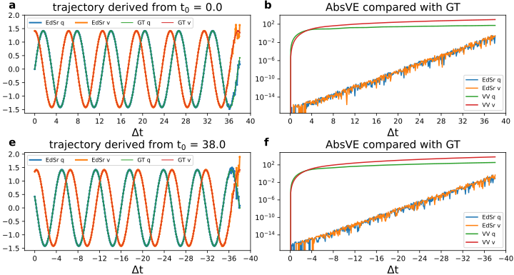| 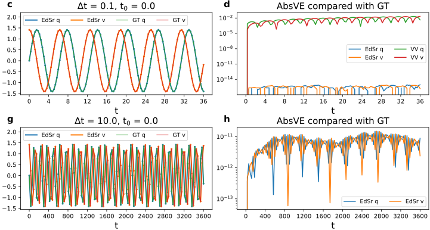
|-|-|

### ideal pendulum

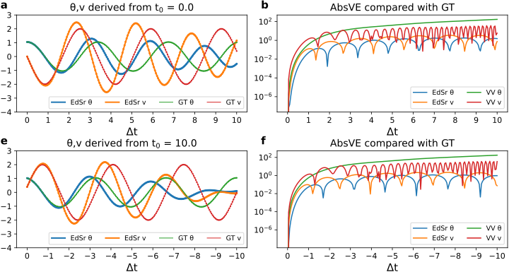 | 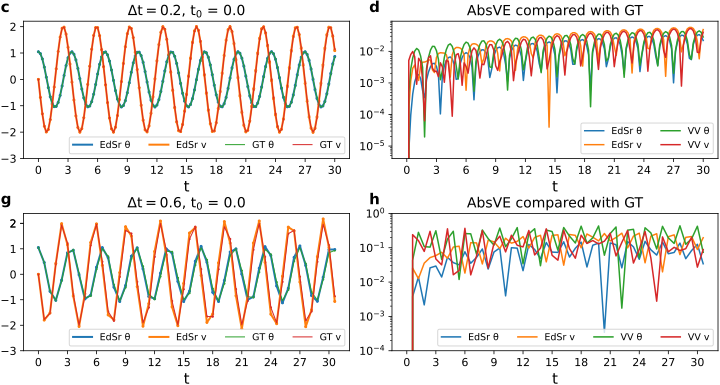
|-|-|

### two-body
    the first experiment
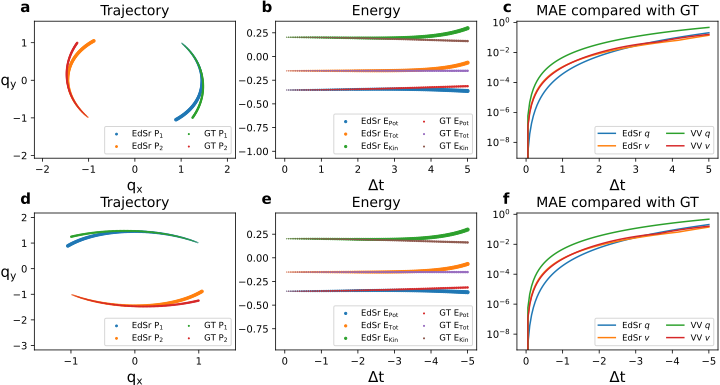

    the second experiment
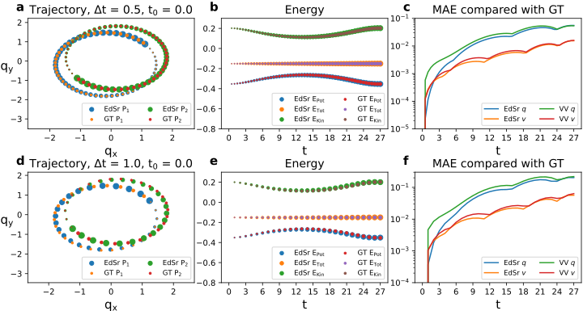

### Indole
    1.0 fs (top) and 3.0 fs (bottom)
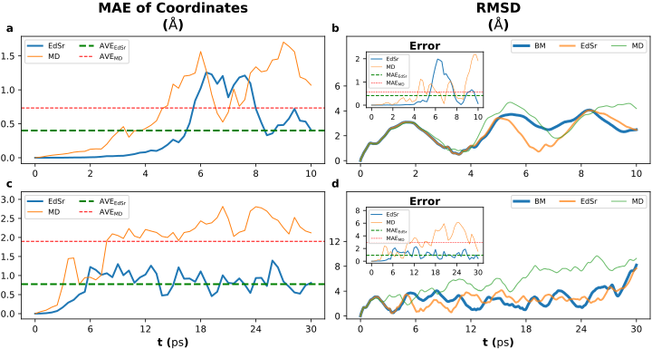
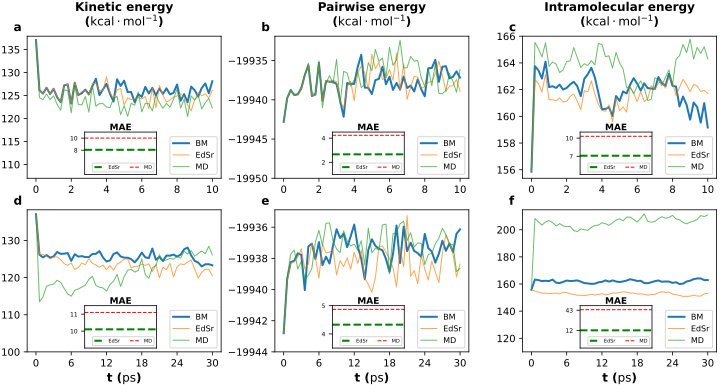
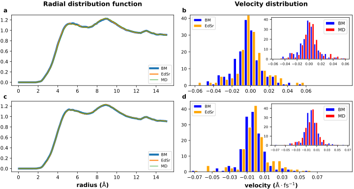

### ubiquitin
    10.0 fs (top) and 20.0 fs (bottom)
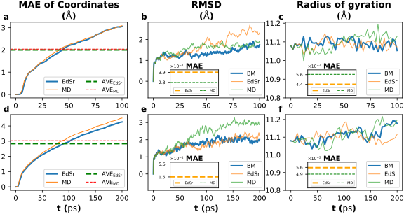
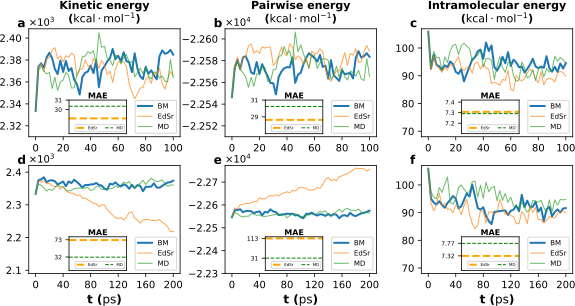
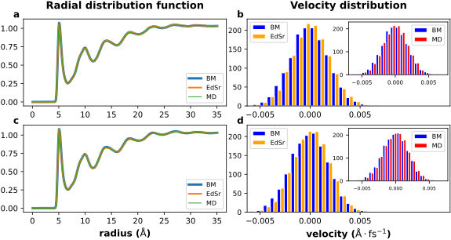


## 🚀 Usage

### Pre-learn

* **PYTHON With LAMMPS in** [tutorial for installation](https://docs.lammps.org/Python_install.html)

* **Gromacs** in [tutorial](https://www.gromacs.org/tutorial_webinar.html)

### Environment set up
we highly recommend Conda because all of our experiments are run under [Miniconda](https://docs.anaconda.com/miniconda/) environment

Before performing every experiment, run the following command to build your Conda environment:
```bash
conda create -n lammps python=3.11.5
```
and then run command `conda activate lammps` to test your environment.

### Examples
we provide two choices for each experiment, you can choose one of them to run experiment.

**For Equation**:
1. run .ipynb file directly.
2. edit Equation/Equation to select function that you want. Run command `python Equation.py` (**Equation_thirdOrder.py** file is for $y = x^3$)

**For IdealSpring**:
1. run .ipynb file directly.
2. run command `python idealSpring.py`

**For IdealPendulum**:
1. run .ipynb file directly.
2. run command `python idealPendulum.py`

**For twoBody**
1. run .ipynb file for simplicity
2. if you want to test your data, you can edit `twoBodies.py` and then run command `python twoBodies.py`.

**For Indole**:

```bash
cd Indole/our
bash EdSr.sh
```
In the `EdSr.sh` bash file, the code is shown as follows:
```bash
#!/bin/bash

# activate your conda env
source ~/miniconda3/etc/profile.d/conda.sh
source activate lammps

# set omp thread
export OMP_NUM_THREADS=16

bash_pid=$$

ntimestep=30
basis=1.0 # benchmark timestep
maxIter=500 # attn taylor equation number of order
ntrajs=20000 # number of frames
mode="taylor" # ['benchmark', 'control', 'taylor', 'vv']
ensemble="nve" # condition, only support nve condition so far.
scale=0 # 0, ~0 mean False, True in python, respectively

prerun_step=0 # before run MD or taylor, you can set this value to run "benchmark" timestep.

thermo=200 # positive integer. similar to the LAMMPS thermo command
split=10000 # number of frames saving to each npz file, non-positive number means the total trajectory will be save into a npz file
drop_last=0 # 0, ~0 mean False, True in python, respectively. if 
logpath="log"
# prefix=""


exec 2>&1>"${logpath}/${mode}_${ensemble}_basis${basis}_intv${ntimestep}_frames${ntrajs}_${bash_pid}.log"

nohup python -u grid_loop.py --ntimestep $ntimestep --basis  $basis    --maxiter $maxIter --ntrajs $ntrajs \
                             --mode      $mode      --en     $ensemble --scale   $scale   --prerun_step $prerun_step \
                             --thermo    $thermo    --split  $split    --drop_last $drop_last &

py_pid=$!
echo 
echo "Current Bash ID: ${bash_pid}"
echo "Python Process ID: ${py_pid}"
echo 

```
You can edit these variables according to your need. For example, if you want to change timestep, you can edit variables `basis` and `ntimestep` in `EdSr.sh` bash file. Benchmark timestep is `basis`. MD or EdSr timestep is `basis * ntimestep`.

*For data visualization, you can run .ipynb file directly after getting data.*

**For ubiquitin[_nowater]**
Before running experiment, you need to generate structure file sppuorted by LAMMPS, namely that you either directly data file supported by **LAMMPS** or generate file supported by **GROMACS** firstly, and then tranform **GROMACS** files to LAMMPS files. 
After that, you can run the following command:
```bash
cd ubiquitin[_nowater]/our
bash EdSr.sh
```
*For data visualization, you can run .ipynb file directly after getting data.*

<div class="admonition question">
<p class="admonition-title">if you want to learn more about this work, feel free to send e-mail to <a href="mailto:libin76@mail.sysu.edu.cn">libin76@mail.sysu.edu.cn</a> with your question. we are willing to answer questions about technical details or scientific questions.</p>
</div>

## 🎓 Citation
If you find our work relevant to your research, please cite:
```
ArXiv:
@misc{cao2024edsrnovelendtoendapproach,
      title={EdSr: A Novel End-to-End Approach for State-Space Sampling in Molecular Dynamics Simulation}, 
      author={Hai-Ming Cao and Bin Li},
      year={2024},
      eprint={2412.20978},
      archivePrefix={arXiv},
      primaryClass={physics.comp-ph},
      url={https://arxiv.org/abs/2412.20978}, 
}
```
